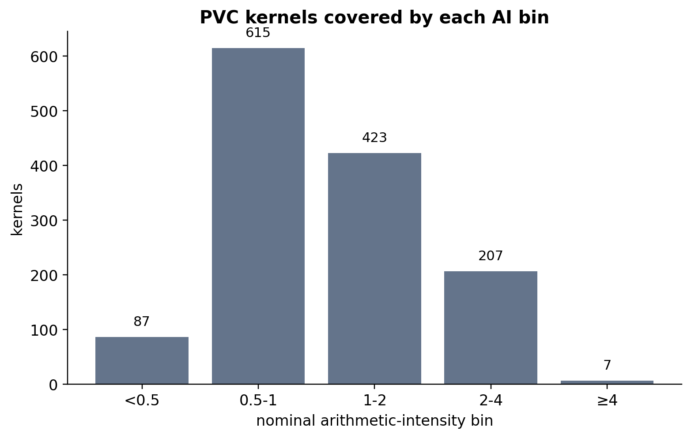
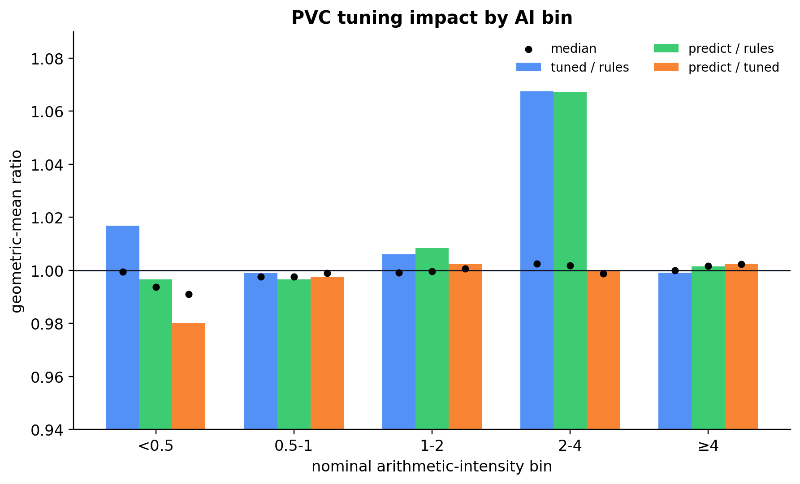
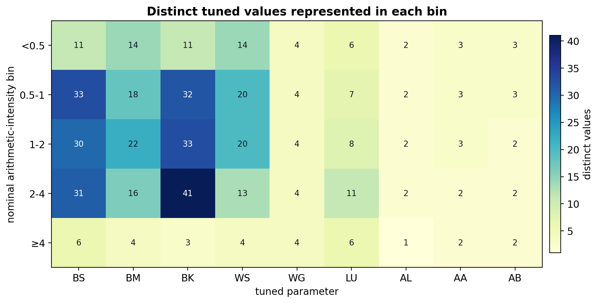

# Self-Diagnosing Parameter Prediction

## Confidence-Gated Models for Sparse Tuning Data

LIBXS Predict

Note: Open with the deployment problem: a predictor is useful only if it
knows when a safe rule should stay in charge.

---

## The Problem

CP2K and DBCSR tune GPU kernels for known matrix shapes.

Deployment sees new shapes between tuned points.

| Choice | Risk |
| --- | --- |
| Fixed rules only | Miss local tuning opportunities |
| Predict everything | Silent slowdowns |
| Confidence-gated | Override only with evidence |

---

## Method in One Slide

Distance-weighted kNN voting plus polynomial fingerprint diagnostics.

The model returns:

- Predicted value.
- Per-output confidence.
- Override/defer signal.

Note: The main phrase is not just prediction, but deployment decision
support.

---

## GPU Kernel Dispatch

Small-matrix GPU kernel dispatch.

Inputs: `M`, `N`, `K`.

Outputs: batch size, block sizes, workgroup shape, loop unroll, layout,
and access selectors.

Training data: tabulated tuned kernels across GPU architectures.

---

## Why Ordinary Accuracy Is Not Enough

Some parameters encode hidden hardware constraints.

Nearby shapes can agree on a value that is wrong for the query.

| Shape | Predicted BK | Rule BK | Result |
| --- | ---: | ---: | ---: |
| 21 × 22 × 23 | 4 | 21 | 487 vs. 991 GF/s |

Average error is not the operational risk.

Note: This example motivates policy separation. The current full-rerun
evidence is summarized later.

---

## Deployment Policy

Separate ownership from prediction.

| Rule controlled | Confidence gated |
| --- | --- |
| `BS`, `BM`, `BN`, `BK`, `WS` | `WG`, `LU`, `AL`, `AA`, `AB` |
| structural safety | preference/access choices |
| source rules stay authoritative | override near-unanimously |

`AL` is the A-linear access-mode flag.

---

## Confidence Signals

| Signal | Time | Used for |
| --- | --- | --- |
| Fingerprint decay | Build | constant, smooth, categorical, erratic |
| kNN vote fraction | Query | per-output deployment confidence |

Fingerprint behavior chooses the output mode.

Neighbor agreement decides whether a prediction may act.

---

## Override Rule

```text
if output is rule-owned:
    use safe rule
else if confidence ≥ threshold:
    use prediction
else:
    use safe rule
```

Abstention is part of LIBXS behavior.

---

## Current PVC Rerun

1339 PVC kernels, three reruns per mode.

| Mode | Meaning | GM GF/s | vs. rules |
| --- | --- | ---: | ---: |
| `noparm` | handwritten source rules | 1464.7 | 1.000 |
| `params` | measured tuned CSV | 1483.4 | 1.013 |
| `predict` | 0.9-compressed predictor | 1480.8 | 1.011 |

Prediction is leave-one-out in spirit: a kernel's tuned row is not used
as its own answer.

---

## PVC Kernel Coverage



Most of the rerun lives in the middle AI bins; the high-AI tail is small.

---

## PVC Tuning Impact



The aggregate gain is not uniform.  The visible movement is concentrated
in the 2--4 bin, while many bins are near neutral.

---

## PVC Parameter Coverage



The table is not equally rich everywhere: some parameters vary broadly,
while others offer only a few alternatives in a bin.

---

## PVC Confidence Projection


The saved 0.9-compressed model is sampled over the full min--max cube.
Worst-K support is the conservative deployment view; mean-K support is
the typical case.

---

## Where the Rerun Moves

Nominal arithmetic-intensity bins.

| AI bin | Tuned/rules | Predict/rules | Predict/tuned |
| --- | ---: | ---: | ---: |
| < 0.5 | 1.017 | 0.997 | 0.980 |
| 0.5–1 | 0.999 | 0.997 | 0.997 |
| 1–2 | 1.006 | 1.008 | 1.002 |
| 2–4 | 1.068 | 1.067 | 1.000 |
| All | 1.013 | 1.011 | 0.998 |

Mixed result: localized gains, median-neutral behavior, and a strong
handwritten baseline.

---

## What Confidence Gating Buys

It changes the failure mode.

| Without gating | With gating |
| --- | --- |
| Wrong values silently deploy | Low evidence defers |
| Average error hides risk | Per-output confidence is visible |
| Outliers look like bugs | Outliers identify missing data |

---

## Beyond Kernel Dispatch

The same LIBXS machinery handles:

- Timeseries forecasting.
- Spatial prediction.
- Cross-series decomposition.
- Non-stationary series with auto-differencing.
- Materials classification.

The interface is still prediction plus confidence.

---

## Reading Literature Comparisons

External numbers are orientation, not a leaderboard.

Studies often differ in:

- Feature sets and preprocessing.
- Split, horizon, or region.
- Temporal or spatial context.
- Metric: MAE, RMSE, NSE, accuracy, speedup.

Useful question: are we in range, and what does confidence say?

---

## Forecasting Checks

| Domain | Ours | Literature | ≈err/σ | Signal |
| --- | ---: | ---: | ---: | --- |
| Sunspots | MAE 17.6 | MAE 19.8–45.5 | 0.26 vs. 0.29–0.67 | cycles |
| Discharge | ≈5% rel. | NSE 0.78–0.99 | 0.23 vs. 0.10–0.47 | season |
| SOI | nRMSE 0.11 / 0.12 | 0.23–0.55 | 0.11–0.12 vs. 0.23–0.55 | spread |

Common scale is approximate: held-out σ for ours; NSE converted as
√(1−NSE); literature datasets still differ.

---

## Ambiguity and Classification

| Task | Ours | Common readout | Confidence |
| --- | ---: | ---: | --- |
| Earthquakes | MAE 0.265 | ≈0.74σ | avg. 0.694 |
| Crystals, all | 79.6% acc. | 20.4% error | full coverage |
| Crystals, conf. ≥ 0.9 | 95.0% acc. | 5.0% error | 53.7% coverage |

Regression uses held-out σ; classification uses error rate.  Confidence
separates ambiguity from high-reliability subsets.

---

## Crystal Sample

<!-- .slide: data-background-image="assets/crystal_system_wheel_background.png" data-background-size="contain" data-background-position="right center" -->

60386 compositions.

37 features.

7 crystal systems.

The sample is not a single smooth regression surface; it is a mixed
classification problem where confidence decides whether to act.

Note: This is a visual pause before the confidence-gating result.  The
sample spans seven crystal systems; the predictor is asked for a useful
deployment signal on top of that mixed classification task.

---

## What the Context Says

Across domains, errors usually land near specialized trained methods on
the reported metric.

The distinctive result is the deployment signal:

- Dense recurring domains: confidence ≈1.
- Ambiguous domains: lower confidence.
- Classification: high-confidence subsets are much more reliable.

---

## Why This Matters for Atomistic Codes

Simulation setup often needs plausible structure or kernel choices before
expensive computation begins.

A confidence-gated predictor can say:

- This guess is supported enough to use.
- This case is ambiguous; keep the conservative path.
- This regime deserves new measurements or another feature.

---

## Fortran-First Feedback Loop

The same lifecycle is exposed to Fortran-heavy applications.

| Running application moment | LIBXS call | Effect |
| --- | --- | --- |
| New measured case | `libxs_predict_push` | append evidence O(1) |
| Checkpoint or idle point | `libxs_predict_build` | rebuild model cheaply |
| Next query | `libxs_predict_eval` | value + confidence |

What this buys: start conservative, learn from completed work, and let
later decisions use the stronger local evidence.

---

## Comparison to Heavier Models

Gaussian processes, neural networks, tree ensembles, and conformal
methods can all expose uncertainty.

The practical difference here is Fortran-first packaging:

- No iterative gradient training.
- O(1) append per entry before rebuild.
- Deterministic construction from tables.
- Per-output confidence in the application.
- Batch/task variants for parallel callers.

---

## Design Pattern

Separate prediction from authority.

```text
prediction → value + confidence
policy     → threshold + rule ownership
action     → override or defer
```

Learned tuning becomes compatible with hard-won domain rules.

---

## Takeaways

- Sparse tuning spaces reward abstention.
- Confidence must be per output.
- Running jobs can add evidence and rebuild at checkpoints.
- Fingerprints diagnose mode choice.
- kNN votes expose local evidence.
- Rule deferral turns uncertainty into safe behavior.

---

## Closing Thought

The useful model is not the one that always has an answer.

It is the one that knows when its answer should not be in charge.
