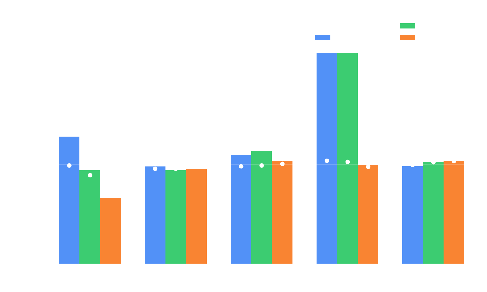
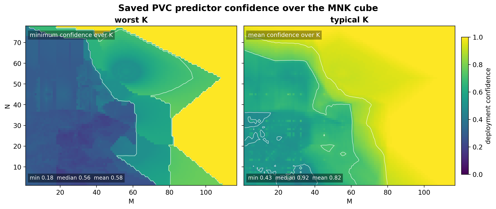

# Self-Diagnosing Parameter Prediction

## Confidence-Gated Models for Sparse Tuning Data

LIBXS Predict

Note: Open with the deployment problem: a predictor is useful only if it
knows when a safe rule should stay in charge.

---

## The Problem

CP2K and DBCSR tune GPU kernels for known matrix shapes.

Deployment sees new shapes between tuned points.

| Choice | Risk |
| --- | --- |
| Fixed rules only | Miss local tuning opportunities |
| Predict everything | Silent slowdowns |
| Confidence-gated | Override only with evidence |

---

## Method in One Slide

Distance-weighted *k*NN voting plus polynomial fingerprint diagnostics.

The model returns:

- Predicted value.
- Per-output confidence.
- Override/defer signal.

Note: The main phrase is not just prediction, but deployment decision
support.

---

## GPU Kernel Dispatch

Small-matrix GPU kernel dispatch.

Inputs: `M`, `N`, `K`.

Outputs: batch size, block sizes, workgroup shape, loop unroll, layout,
and access selectors.

Training data: tuned kernels across GPU architectures (Intel PVC
shown here; method is device-agnostic).

---

## Why Ordinary Accuracy Is Not Enough

Some parameters encode hidden hardware constraints.

Nearby shapes can agree on a value that is wrong for the query.

| Shape | Predicted BK | Rule BK | Result |
| --- | ---: | ---: | ---: |
| 21 × 22 × 23 | 4 | 21 | 487 vs. 991 GF/s |

Average error is not the operational risk.

Note: This example motivates policy separation. The current full-rerun
evidence is summarized later.

---

## Deployment Policy

Separate ownership from prediction.

| Rule controlled | Confidence gated |
| --- | --- |
| `BS`, `BM`, `BN`, `BK`, `WS` | `WG`, `LU`, `AL`, `AA`, `AB` |
| structural safety | preference/access choices |
| source rules stay authoritative | override near-unanimously |

SMM kernel parameters: BS batch-size, BM/BN/BK block extents,
WS work-sharing, WG workgroup shape, LU unroll, AL/AA/AB access modes.

---

## Confidence Signals

| Signal | Time | Used for |
| --- | --- | --- |
| Fingerprint decay | Build | constant, smooth, categorical, erratic |
| *k*NN vote fraction | Query | per-output deployment confidence |

Fingerprint behavior chooses the output mode.

Neighbor agreement decides whether a prediction may act.

---

## Override Rule

```text
if output is rule-owned:
    use safe rule
else if confidence ≥ threshold:
    use prediction
else:
    use safe rule
```

Abstention is part of LIBXS behavior.  Learned tuning becomes
compatible with hard-won domain rules.

---

## PVC Tuning Structure



1339 PVC kernels, three reruns per mode.  Tuning gives +1.3% over
handwritten rules; LOO prediction reaches +1.1%.  The gain
concentrates in compute-heavy shapes (AI 2–4: +6.8%, 41 distinct BK
values).  Other bins are near neutral — the rules are already strong.

---

## PVC Confidence Projection



Over the M × N × K cube (739k queries), 39% fall below the 0.9
threshold (defer to rules).  The distribution is bimodal: confident
or clearly insufficient — the gate fires decisively.

---

## What Confidence Gating Buys

It changes the failure mode.

| Without gating | With gating |
| --- | --- |
| Wrong values silently deploy | Low evidence defers |
| Average error hides risk | Per-output confidence is visible |
| Outliers look like bugs | Outliers identify missing data |

---

## Beyond Kernel Dispatch

The same LIBXS machinery handles:

- Timeseries forecasting.
- Spatial prediction.
- Cross-series decomposition.
- Non-stationary series with auto-differencing.
- Materials classification.

The interface is still prediction plus confidence.

---

## Crystal System Prediction

<!-- .slide: data-background-image="assets/crystal_system_wheel_slide.png" data-background-size="contain" data-background-position="right center" style="text-align: left" -->

- 60 386 compositions
- 37 features
- 7 crystal systems

The sample is a mixed classification problem  
where confidence decides whether to act.

Note: This is the key slide for computational chemistry audience.
Structure initialization in CP2K/FHI-aims requires symmetry information;
a confidence-gated predictor can provide it or abstain.

---

## Secondary Evidence

| Domain | Ours | Literature | Confidence |
| --- | ---: | ---: | --- |
| Sunspots | MAE 17.6 | MAE 19.8–45.5 | 1.0 (dense cycles) |
| Discharge | 0.23 err/σ | 0.10–0.47 | 1.0 (seasonal) |
| SOI | nRMSE 0.11 | 0.23–0.55 | 1.0 (spread modes) |
| Earthquakes | MAE 0.265 | 0.184–0.283 | 0.694 (ambiguous) |
| Crystals | 79.6% → 95.0% (conf ≥ 0.9) | ≈75–80% | 54% gated coverage |

Confidence separates dense-coverage domains from genuinely ambiguous
ones.  Literature comparisons are orienting — different features, splits,
metrics.

---

## Why This Matters for Atomistic Codes

Simulation setup often needs plausible structure or kernel choices before
expensive computation begins.

A confidence-gated predictor can say:

- This guess is supported enough to use.
- This case is ambiguous; keep the conservative path.
- This regime deserves new measurements or another feature.

---

## Fortran-First Feedback Loop

No Python, no framework dependency — links into your Fortran binary.

| Running application moment | LIBXS call | Effect |
| --- | --- | --- |
| New measured case | `libxs_predict_push` | append evidence 𝒪(1) |
| Checkpoint or idle point | `libxs_predict_build` | rebuild model cheaply |
| Next query | `libxs_predict_eval` | value + confidence |

Start conservative, learn from completed work, and let later decisions
use the stronger local evidence.

---

## Takeaways

- Sparse tuning spaces reward abstention.
- Confidence must be per output.
- Running jobs can add evidence and rebuild at checkpoints.
- Fingerprints diagnose mode choice.
- *k*NN votes expose local evidence.
- Rule deferral turns uncertainty into safe behavior.

---

## Closing Thought

The useful model is not the one that always has an answer.

It is the one that knows when its answer should not be in charge.
