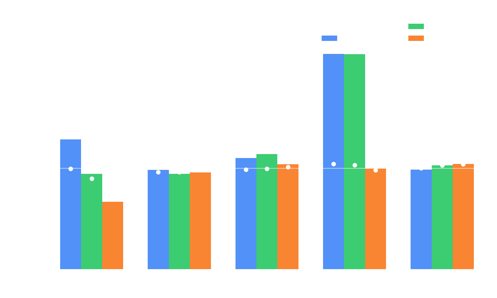
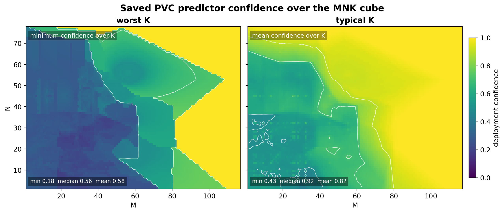

# Self-Diagnosing Parameter Prediction

## Confidence-Gated Models for Sparse Tuning Data

LIBXS Predict

Note: Open with the deployment problem: a predictor is useful only if it
knows when a safe rule should stay in charge.

---

## The Problem

CP2K and DBCSR use tuned GPU kernels for known matrix shapes.  
However, deployment sees new shapes between tuned points.

| Choice             | Risk                            |
| ------------------ | ------------------------------- |
| Fixed rules only   | Miss local tuning opportunities |
| Predict everything | Silent slowdowns                |
| Confidence-gated   | Override only with evidence     |

<span style="opacity: 0.4; font-size: 50%;">Prior work predicted offline
based on hardware-occupancy features using XGBoost \[Jakobovits 2019\].</span>

---

## Method in One Slide

Distance-weighted *k*NN voting plus polynomial fingerprint diagnostics.

The model returns:

- Predicted value.
- Per-output confidence.
- Override/defer signal.

Note: The main phrase is not just prediction, but deployment decision
support.

---

## GPU Kernel Dispatch

Small-matrix GPU kernel dispatch from inputs `M`, `N`, and `K`.

**Output**: batch size, block sizes, workgroup shape,  
loop unroll, layout, and access selectors.

**Training data**: tuned kernels parameters  
(device-agnostic, Intel PVC shown here).

---

## Why Ordinary Accuracy Is Not Enough

Some parameters encode hidden hardware constraints.

Nearby shapes can agree on a value that is wrong for the query.

| Shape        | Predicted BK | Rule BK | Result           |
| ------------ | -----------: | ------: | ---------------: |
| 21 × 22 × 23 |            4 |      21 | 487 vs. 991 GF/s |

Average error is not the operational risk, e.g., Mean Absolute Error.

Note: This example motivates policy separation. The current full-rerun
evidence is summarized later.

---

## Deployment Policy

Separate ownership from prediction.

| Rule controlled                 | Confidence gated             |
| ------------------------------- | ---------------------------- |
| `BS`, `BM`, `BN`, `BK`, `WS`    | `WG`, `LU`, `AL`, `AA`, `AB` |
| structural safety               | preference/access choices    |
| source rules stay authoritative | override near-unanimously    |

SMM kernel parameters: BS batch-size, BM/BN/BK block extents,  
WS work-sharing, WG workgroup shape, LU unroll,  
AL/AA/AB access modes.

---

## Confidence Signals

| Signal              | Time  | Used for                               |
| ------------------- | ----- | -------------------------------------- |
| Fingerprint decay   | Build | constant, smooth, categorical, erratic |
| *k*NN vote fraction | Query | per-output deployment confidence       |

Fingerprint behavior chooses the output mode.

Neighbor agreement decides whether a prediction may act.

---

## Override Rule

```text
if output is rule-owned:
    use safe rule
else if confidence ≥ threshold:
    use prediction
else:
    use safe rule
```

Abstention is part of LIBXS behavior. Learned tuning  
becomes compatible with hard-won domain rules.

---

## Tuned GPU Parameters



1339 PVC kernels, three reruns per mode.  Tuning gives +1.3% over
handwritten rules; LOO prediction reaches +1.1%.  The gain
concentrates in compute-heavy shapes (AI 2–4: +6.8%, 41 distinct BK
values).  Other bins are near neutral — the rules are already strong.

---

## Confidence Projection



Over the M × N × K cube (739k queries), 42% fall below the 0.9
threshold (defer to rules).  58% sit at or above it, but the rest is
graded rather than split: 22% lands in \[0.8, 0.9) — just short of the
gate.  The threshold is a policy choice on a continuum.

---

## What Confidence Gating Buys

It changes the failure mode.

| Without gating               | With gating                      |
| ---------------------------- | -------------------------------- |
| Wrong values silently deploy | Low evidence defers              |
| Average error hides risk     | Per-output confidence is visible |
| Outliers look like bugs      | Outliers identify missing data   |

How to know if a parameter is confidently predicted?  
Well, if you know how to predict...

Note: confidence = (sum of weights voting for winner) / (sum of all weights).
A continuous output has no winner to count, so it reports 1.0 and callers read
info->variance instead. Folding that spread into the confidence was tried and
removed: it measured worse on every case it applied to once the number of
blended clusters was derived from the confidence rather than fixed.

---

## Beyond Kernel Dispatch

The same LIBXS machinery handles:

- Timeseries forecasting.
- Spatial prediction.
- Cross-series decomposition.
- Non-stationary series with auto-differencing.
- Materials classification.

The interface is still prediction plus confidence.

---

## Crystal System Prediction

<!-- .slide: data-background-image="assets/crystal_system_wheel_slide.png" data-background-size="contain" data-background-position="right center" style="text-align: left" -->

- 60 386 compositions
- 37 features
- 7 crystal systems

The sample is a mixed classification problem  
where confidence decides whether to act.

<span style="opacity: 0.4; font-size: 50%;">AFLOW: An Automatic Framework
for High-Throughput Materials Discovery \[Curtarolo 2012\].</span>

Note: This is the key slide for computational chemistry audience.
Structure initialization in CP2K/FHI-aims requires symmetry information;
a confidence-gated predictor can provide it or abstain.

---

## Gradient-Boosted Baseline

Same corpus, same split, same metric — `xgb` in the samples.

| PVC exact-match               | Ours     | XGBoost  |
| ----------------------------- | -------: | -------: |
| Gated outputs                 |   24–87% |   28–88% |
| Rule-owned `BM`, `WS`         | 35%, 49% | 86%, 88% |
| Largest shapes held out: `WS` |    12.7% |     1.1% |

Boosting's margin sits on rule-owned outputs, which never act —  
and it collapses where it has to extrapolate.

Note: XGBoost 3.0.0 via the C API, 200 rounds, depth 6, eta 0.1. Each output is
posed the task the fingerprint chose for LIBXS: classification over the attested
value set, or regression. Exact match is a proxy - the shipped CSVs carry no
GFLOPS, so an equally fast kernel with other parameters counts as a miss for
both. Last row is the default prefix split; the CSV is sorted by problem size,
so that split holds out the largest shapes. The others use `mix`.

---

## Matched Metric, Three Domains

| Same split, same metric             | Ours      | XGBoost   |
| ----------------------------------- | --------: | --------: |
| Crystals, accuracy (all queries)    | **82.3%** | 78.3%     |
| Crystals, precision at ~47% coverage| **96.8%** | 96.5%     |
| Earthquakes, MAE                    | 0.237     | 0.237     |
| ETTh1, MSE at window 6 †            | 0.245     | **0.225** |
| ETTh1, MSE at window 96 †           | **0.320** | 0.436     |

Window choice moves more than the model choice does —  
and our sizer picks 6 over the conventional 96.

Note: crystal rows come from a gate sweep (`GATE=...`), not one threshold - at
the single 0.9 gate it reads 96.4%/52.3% against 98.6%/19.9%, which looks like a
calibration gap and is two points on one curve. Boosting is the sharper signal
and much the more conservative: it leads on precision at every gate but always at
a fraction of the coverage, and the ordering reverses wherever the coverage is
useful (at ~70% coverage 93.8% against 90.2%). It overtakes only below ~35%
coverage, reaching 100% at 1.8%. Earthquakes: 0.254 if the boosted objective is
left unaligned to the MAE metric, which alone inverts the result. † ETT rows were
not re-measured in the latest campaign: that run produced no output at all, so
the boosted side of those two rows is older than the rest of the table.

---

## The Mode Is Now Chosen, Not Configured

`set_decompose(LIBXS_PREDICT_AUTO_DECOMPOSE)` builds each applicable mode on part
of the corpus and keeps the one that wins on a part held back.

| Corpus                            | Default (RAW) | Selected  | Selected mode |
| --------------------------------- | ------------: | --------: | ------------- |
| Crystals, held-out accuracy       |         73.3% | **82.3%** |          RF   |
| River discharge, MAE ‡            |           868 |   **791** |          hkNN |
| Tuned GPU parameters, miss rate ‡ |         0.306 | **0.253** |          RF   |

‡ not re-measured in the latest campaign; the crystal row is current.

A fixed default costs 22% on average, and the worst candidate on discharge is
2.8x worse than the best - the right mode moves with the corpus.

Note: rows are default against selected on that corpus' own split. Nine
held-back configurations, 9/9 correct at four and seven candidates,
7/9 at two. More candidates were *safer*: both wrong picks are near-ties at two
candidates, where the arbitrary choice costs nothing, and adding a mode that wins
by a real margin gives the validation slice something it can resolve. Costs one
build per candidate (per fold on a series), so it is requested, not the default.
Per-output selection was measured and does not pay: about 2% of oracle headroom,
none of it reachable, because the model-level score averages sixteen outputs and
that averaging is what makes the estimate stable.

---

## The Vote Was Reading Too Many Neighbours

`set_neighbors(-1)` resolves the count per output at build, on entries held back
from a probe build.

| Corpus                            | Derived count | Selected   | Change |
| --------------------------------- | ------------: | ---------: | -----: |
| Crystals, held-out accuracy ‡     |         67.8% |  **74.8%** | +10.4% |
| Crystals, miss rate ‡             |        0.3223 | **0.2520** | -21.8% |
| Tuned GPU parameters, miss rate ‡ |        0.3062 | **0.2826** |  -7.7% |

‡ not re-measured. The count is now also refused where its confidence cannot
vary: one neighbour votes unanimously whatever it holds, which pins the
confidence at 1.0 and leaves a gate nothing to select on.

The derived `max(5, cluster/3)` is too large everywhere, and the right count is
not a function of cluster size: hold the cluster at 56 entries and vary only the
dimension of the subspace the data lies on, and the best count runs 18, 5, 1 at
dimensions 1, 2, 3.

Note: not a duplicate-row artifact, though the crystal corpus is full of them - a
query with an exact match never reaches the vote, and splitting the held-out rows
by distance to their nearest stored neighbour puts the entire gain on the half
with no close match (0.7306 to 0.5524). Not a formula either: the optimum returns
to 8 by dimension 10, where the label is noisy enough per neighbour that
averaging pays again, so n^(4/(4+d)) predicts none of it. Cheap where the mode
trial is not - the count changes nothing about the model, so one probe build
serves the whole grid.

---

## Secondary Evidence

| Domain         | Ours                       | Literature      | Confidence               |
| -------------- | -------------------------: | --------------: | ------------------------ |
| ETT\*\* (H=96) | MSE 0.244                  | 0.370–0.449     | 0 parameters, 1 CPU core |
| Sunspots       | MAE 16.8 (20.3 at t+6)     | MAE 19.8–45.5   | 1.0 (dense cycles)       |
| Discharge      | 0.18 err/σ                 | 0.10–0.47 err/σ | 1.0 (seasonal)           |
| SOI\*          | nRMSE 0.11 (0.07 hKNN)     | 0.23–0.55       | 1.0 (spread modes)       |
| Earthquakes    | MAE 0.237 (0.244 flat kNN) | 0.184–0.283     | 0.955 (ambiguous)        |
| Crystals       | 82.3% → 96.4% (conf ≥ 0.9) | ≈75–80%         | 52% gated coverage       |

Confidence separates dense-coverage domains from genuinely ambiguous
ones.  Literature comparisons are orienting — different features, splits,
metrics.  ETT is the exception: same dataset, same split, same horizon.

<span style="opacity: 0.4; font-size: 50%;">Results for comparison
\[Dang2022\], \[Akkala2025\], \[Kratzert2018\], \[Kratzert2019\], \[Simatupang2025\],
\[Ahmed2024\], \[Kaftan2025\], \[Nie2023\], \[Zeng2023\], \[Zhou2022\], \[Wu2021\]</span>

<span style="opacity: 0.4; font-size: 50%;">\* SOI: Southern Oscillation Index,
\*\* ETT: Electricity Transformer Temperature (ETTh1), standard timeseries
benchmark; baselines are PatchTST, DLinear, FEDformer, Autoformer</span>

Note: The Southern Oscillation Index (SOI) measures the difference in air pressure between
Tahiti and Darwin, Australia, serving as a key indicator of El Niño and La Niña events.

---

## Why This Matters for Atomistic Codes

Simulation setup often needs plausible structure or  
kernel choices before expensive computation begins.

A confidence-gated predictor can say:

- This guess is supported enough to use.
- This case is ambiguous; keep the conservative path.
- This regime deserves new measurements or another feature.

---

## Fortran-First Feedback Loop

No Python, no framework dependency — links into your Fortran binary.

| Running application moment | LIBXS call               | Effect                |
| -------------------------- | ------------------------ | --------------------- |
| Load existing knowledge    | `libxs_predict_load_csv` | seed model from file  |
| New measured case          | `libxs_predict_push`     | append evidence 𝒪(1)  |
| Checkpoint or idle point   | `libxs_predict_build`    | rebuild model cheaply |
| Next query                 | `libxs_predict_eval`     | value + confidence    |

Start from a CSV of prior runs or start empty — learn from completed  
work, and let later decisions use the stronger local evidence.

---

## Takeaways

- Sparse tuning spaces reward abstention.
- Confidence must be per output.
- Running jobs can add evidence  
  and rebuild at checkpoints.
- Fingerprints diagnose mode choice.
- *k*NN votes expose local evidence.
- Rule deferral turns uncertainty  
  into safe behavior.

---

## Closing Thought

The useful model is not the one that *always* has an answer.

It is the one that knows when its answer should not be in charge.

<span style="opacity: 0.3;">This slide set: https://libxs.readthedocs.io/predict/  
LIBXS: https://libxs.readthedocs.io/
</span>

---

## What Else is in LIBXS?

| Domain          | Summary                                                        |
|-----------------|----------------------------------------------------------------|
| Permutation     | Co-prime shuffling, smooth row permutations, stratification    |
| Histogram       | Thread-safe histogram with running statistics                  |
| Registry        | Thread-safe key-value store with per-thread caching            |
| Hashing         | CRC32-based hashing, Adler-32, string hashing                  |
| **Predict**     | Fingerprint-guided parameter prediction with model persistence |
| Malloc          | Pool-based allocator (steady-state, no system calls)           |
| Memory          | Byte comparison, matrix copy/transpose, alignment queries      |
| String          | Edit distance, substring search, word similarity, formatting   |
| Timer           | High-resolution timing via calibrated TSC                      |
| CPUID           | CPU feature detection (SSE to AVX-512, AArch64, RISC-V)        |
| GEMM            | Batched dense GEMM (strided, pointer-array, grouped)           |
| Math            | Matrix comparison, GCD/LCM, coprime, BF16 conversion           |
| MHD             | Read/write MetaImage (MHD/MHA) files                           |
